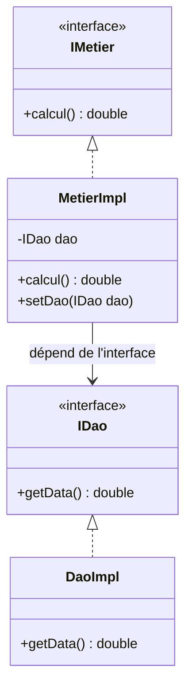

# Rapport de TP : Inversion de Contrôle et Injection des Dépendances

> **Module :** Architecture JEE / Spring
> **Thème :** Couplage faible, Injection des dépendances (statique, dynamique, Spring XML, Spring annotations)
> **Auteur :** _EL OUARDINI Anwar_
> **Encadrant :** _Professeur YOUSSFI Mohamed_
> **Année universitaire :** 2026 / 2027

---

## Table des matières

1. [Introduction](#1--introduction)
2. [Énoncé](#2--énoncé)
3. [Conception](#3--conception)
4. [Code source](#4--code-source)
5. [Conclusion](#5--conclusion)

---

## 1- Introduction

Dans le développement d'applications Java, un des principaux défis est de produire un code **maintenable**, **évolutif** et **testable**. Un couplage fort entre les classes (une classe qui instancie directement une autre avec `new`) rend l'application rigide : toute modification d'une classe oblige à modifier celles qui en dépendent.

Pour résoudre ce problème, on utilise :

- **Le couplage faible** : les classes dépendent d'**interfaces** et non d'implémentations concrètes.
- **L'Inversion de Contrôle (IoC)** : la création et la liaison des objets ne sont plus gérées par le code métier, mais par un tiers (le développeur dans une classe de présentation, un fichier de configuration, ou un framework comme **Spring**).
- **L'Injection des Dépendances (DI)** : mécanisme par lequel une dépendance est fournie à un objet de l'extérieur (via un setter, un constructeur ou un attribut).

Ce TP met en pratique ces concepts à travers une petite application en couches (**DAO → Métier → Présentation**) et montre quatre façons d'injecter les dépendances.

---

## 2- Énoncé

1. Créer l'interface `IDao` avec une méthode `getData`.
2. Créer une implémentation de cette interface.
3. Créer l'interface `IMetier` avec une méthode `calcul`.
4. Créer une implémentation de cette interface en utilisant le **couplage faible**.
5. Faire l'injection des dépendances :
    - a. Par **instanciation statique**
    - b. Par **instanciation dynamique**
    - c. En utilisant le **Framework Spring**
        - Version **XML**
        - Version **annotations**

---

## 3- Conception

### 3.1 Architecture en couches

```
┌───────────────────────┐
│     Présentation      │   Pres1, Pres2, PresSpringXML, PresSpringAnnotations
└───────────┬───────────┘
            │ utilise
┌───────────▼───────────┐
│     Couche Métier     │   IMetier  ◄──  MetierImpl
└───────────┬───────────┘
            │ utilise (couplage faible)
┌───────────▼───────────┐
│      Couche DAO       │   IDao  ◄──  DaoImpl
└───────────────────────┘
```

### 3.2 Diagramme de classes



### 3.3 Principe du couplage faible

`MetierImpl` ne connaît **que l'interface `IDao`**. Il ne sait pas quelle implémentation lui sera fournie (base de données, web service, capteur, fichier, etc.). Il suffit de créer une nouvelle classe implémentant `IDao` et de changer l'injection pour modifier le comportement, **sans toucher au code métier**.

### 3.4 Stratégies d'injection étudiées

| # | Stratégie | Où est faite la liaison ? | Modification sans recompilation ? |
|---|-----------|---------------------------|-----------------------------------|
| a | Instanciation statique | Dans le code (`new`) | Non |
| b | Instanciation dynamique | Fichier `config.txt` + réflexion Java | Oui |
| c-1 | Spring XML | Fichier `applicationContext.xml` | Oui |
| c-2 | Spring annotations | `@Component`, `@Autowired` dans le code | Partiellement |

### 3.5 Structure du projet

```
TP-IoC-DI/
├── pom.xml
├── config.txt
└── src/
    └── main/
        ├── java/
        │   ├── dao/
        │   │   ├── IDao.java
        │   │   └── DaoImpl.java
        │   ├── metier/
        │   │   ├── IMetier.java
        │   │   └── MetierImpl.java
        │   └── presentation/
        │       ├── Pres1.java                  (statique)
        │       ├── Pres2.java                  (dynamique)
        │       ├── PresSpringXML.java          (Spring XML)
        │       └── PresSpringAnnotations.java  (Spring annotations)
        └── resources/
            └── applicationContext.xml
```

---

## 4- Code source

Cette section décrit le rôle de chaque fichier du projet, dans l'ordre des étapes de l'énoncé.

### 4.1 Dépendances (`pom.xml`)

Le projet est géré avec **Maven**. La seule dépendance nécessaire est le module **`spring-context`** du framework Spring, qui fournit le conteneur IoC (utilisé uniquement pour les étapes 5-c).

### 4.2 Étape 1 : Interface `IDao` (package `dao`)

Interface qui représente la couche d'accès aux données. Elle déclare une seule méthode, **`getData()`**, qui retourne une valeur de type `double`.

### 4.3 Étape 2 : Implémentation `DaoImpl` (package `dao`)

Classe qui implémente `IDao`. Sa méthode `getData()` simule la lecture d'une donnée dans une base de données : elle affiche un message dans la console (« Version base de données ») puis retourne une valeur fixe (par exemple une température de 34).

### 4.4 Étape 3 : Interface `IMetier` (package `metier`)

Interface qui représente la couche métier. Elle déclare une seule méthode, **`calcul()`**, qui retourne le résultat d'un traitement de type `double`.

### 4.5 Étape 4 : Implémentation `MetierImpl` avec couplage faible (package `metier`)

Classe qui implémente `IMetier`. Points clés :

- Elle possède un **attribut de type `IDao`** (l'interface et non `DaoImpl`) : c'est ce qui crée le **couplage faible**.
- La méthode `calcul()` appelle `getData()` sur cet attribut, puis applique une formule mathématique à la valeur récupérée.
- Elle expose un **setter `setDao(IDao dao)`** qui permet de recevoir de l'extérieur l'objet à utiliser : c'est le point d'entrée de l'**injection des dépendances**.

### 4.6 Étape 5-a : Injection par instanciation statique (`Pres1`)

La classe de présentation crée explicitement les objets avec l'opérateur `new` (un `DaoImpl` et un `MetierImpl`), puis injecte le DAO dans le métier en appelant `setDao()`. Elle affiche enfin le résultat de `calcul()`.
Le couplage est ici reporté dans la classe de présentation : changer d'implémentation oblige à modifier le code et à recompiler.

### 4.7 Étape 5-b : Injection par instanciation dynamique (`Pres2`)

- Un fichier texte **`config.txt`** contient les noms complets des classes à utiliser : la classe du DAO sur la première ligne, la classe du métier sur la seconde.
- `Pres2` lit ce fichier, charge les classes par leur nom grâce à la **réflexion Java** (`Class.forName`), crée les instances dynamiquement, puis appelle `setDao()` par réflexion pour réaliser l'injection.
- Pour changer d'implémentation, il suffit de **modifier le fichier de configuration**, sans recompiler.

### 4.8 Étape 5-c-1 : Spring, version XML (`PresSpringXML`)

- Le fichier **`applicationContext.xml`** déclare deux beans : le bean du DAO (`DaoImpl`) et le bean du métier (`MetierImpl`). Le bean du métier reçoit le DAO via une balise `property` qui référence le bean du DAO (injection par setter).
- `PresSpringXML` charge ce fichier avec un `ClassPathXmlApplicationContext`, récupère le bean du métier avec `getBean()` et appelle `calcul()`.
- La classe Java ne contient aucune création d'objet : Spring s'en charge entièrement.

### 4.9 Étape 5-c-2 : Spring, version annotations (`PresSpringAnnotations`)

- Les classes `DaoImpl` et `MetierImpl` sont annotées avec **`@Component`** pour être déclarées comme beans Spring.
- Dans `MetierImpl`, l'attribut de type `IDao` est annoté avec **`@Autowired`** (et `@Qualifier` pour désigner le bean voulu) : Spring injecte automatiquement la dépendance, le setter n'est plus indispensable.
- `PresSpringAnnotations` utilise un `AnnotationConfigApplicationContext` qui **scanne les packages** `dao` et `metier`, puis récupère le bean `IMetier` et appelle `calcul()`.
- Aucun fichier XML n'est nécessaire.

---

## 5- Conclusion

Ce TP a permis de mettre en œuvre le principe du **couplage faible** et de comparer quatre techniques d'**injection des dépendances** :

| Technique | Avantages | Inconvénients |
|-----------|-----------|---------------|
| **Statique** | Simple à écrire et à comprendre | Fort couplage dans la classe de présentation ; toute modification impose une recompilation |
| **Dynamique** | Changement d'implémentation via un fichier de configuration, sans recompiler | Code plus lourd (réflexion, gestion des exceptions) |
| **Spring XML** | Configuration externalisée et centralisée, code Java totalement indépendant de Spring | Fichier XML verbeux, risque d'erreurs de saisie |
| **Spring annotations** | Code concis, configuration proche du code, lisibilité | Configuration disséminée dans les classes ; dépendance au framework |

Grâce à l'utilisation d'**interfaces** (`IDao`, `IMetier`), la couche métier est restée **fermée à la modification mais ouverte à l'extension** : changer la source de données revient simplement à créer une nouvelle implémentation de `IDao` et à modifier la configuration.

Le framework **Spring** automatise la création des objets et leur liaison, ce qui allège le code, facilite les tests unitaires (on peut injecter des *mocks*) et améliore la maintenabilité des applications d'entreprise.